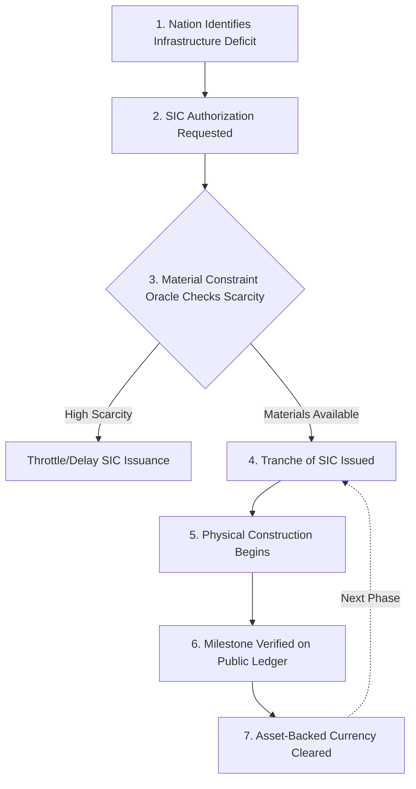
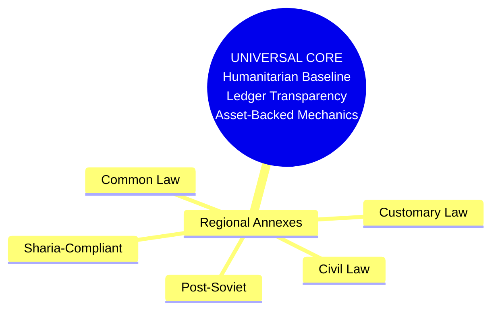
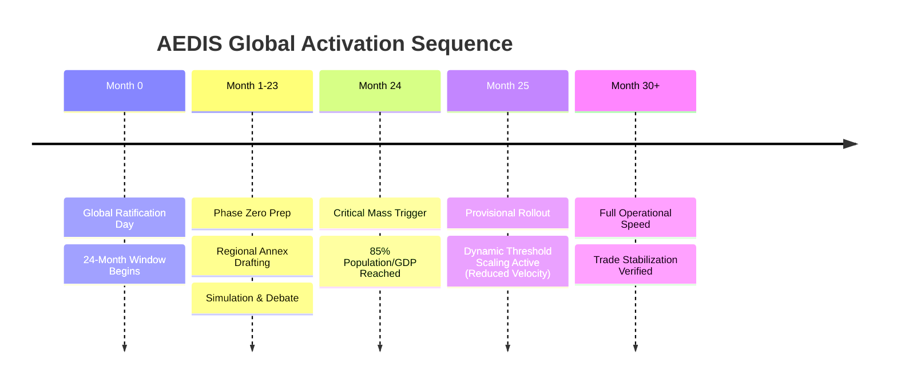

# AEDIS: An Open-Source Macroeconomic Framework for the Autonomous Era

## Introduction
The Advanced Economic Development and Infrastructure System (AEDIS) addresses the defining crisis of our time: AI-driven workforce displacement and the resulting collapse of global consumer demand. This is not a theoretical threat—it is measurable today in surging housing costs, food inflation, and structural tech-sector layoffs.

AEDIS offers a comprehensive, mathematically grounded blueprint for pivoting the global workforce toward building the massive physical infrastructure required for the Autonomous Era. It bypasses traditional fiat debt via **Sovereign Infrastructure Credit (SIC)** and enforces absolute transparency through a **Public Ledger**.

## Our Collaborative Mission
This proposal was developed to create a viable, asset-backed path forward for global economic transformation. However, no single perspective can account for the legal frameworks, resource constraints, and cultural realities of 195 nations.

AEDIS is built on a modular architecture: a non-negotiable **Universal Core** and flexible **Regional Annexes**. We need your help to build those annexes and adapt AEDIS for your specific country.

## How to Contribute
We invite economists, data scientists, legal scholars, and technologists to stress-test and localize this framework. You can contribute by:
* **Opening an Issue:** To debate economic mechanisms, simulate inflation safeguards, or point out structural vulnerabilities.
* **Submitting a Pull Request:** To draft a Regional Legal Annex (e.g., Common Law, Civil Law, Sharia-Compliant), translate the core document into a new language, or propose localized infrastructure priorities.
* **Using AI Tools:** We actively encourage using advanced AI models to analyze the framework and generate country-specific implementation pathways.

## Translation Support
To make this truly global, we need native speakers to translate the Universal Core. Please feel free to use AI translation tools to draft versions of the proposal in your native language, and submit them for community review.

## Acknowledging Realities
We recognize that some may reject this framework due to vested interests in maintaining legacy systems that profit from artificial scarcity. We welcome rigorous, data-driven criticism, but ask that all engagement focuses on empirically improving the framework rather than defending obsolete power structures.

The era of human cognitive labor is ending. The era of human infrastructure building must begin immediately.

---

## AEDIS Visual Architecture

### 1. The SIC Flow Diagram

### 2. Modular Architecture

### 3. Activation Timeline

---

## Frequently Asked Questions (FAQ)

**Q1: How does AEDIS prevent hyperinflation if nations can issue new capital?**

A: AEDIS neutralizes inflation through two primary mechanisms: 1) The "Empty Room" Principle, which pairs capital creation strictly with verified physical asset creation, and 2) The Material Constraint Oracle, which automatically throttles SIC issuance velocity based on real-time global commodity scarcity. Additionally, the SIC Sink mechanism temporarily diverts capital during localized inflation spikes.

**Q2: How can developing nations, which may lack initial technical capacity, participate effectively?**

A: AEDIS includes the "Infrastructure Leapfrog Protocol," which prioritizes decentralized, localized systems over centralized models. It provides pre-approved vendor lists and templates for rapid deployment, mandates 80% local labor preference to retain capital, and offers specialized SIC authorization for climate and ecological emergencies.

**Q3: What prevents powerful nations or corporations from capturing the AEDIS system for their own benefit?**

A: The "Corruption Firewall" built into the Public Ledger makes any fund diversion mathematically visible and permanently recorded. "White Box Procurement" mandates open-source specifications to prevent single-vendor capture. Furthermore, enforcement is collective and economic—non-compliant entities face suspension, which isolates them from the global AEDIS economy.

**Q4: Why is a global simultaneous activation necessary? Why not start with pilot programs?**

A: Global supply chains are now fully interdependent. Isolated, geographic pilot programs would trigger catastrophic capital flight and currency contagion from non-AEDIS zones. The "Critical Mass Trigger" (85% of global population and GDP) and "Dynamic Threshold Scaling" ensure a coordinated, shock-proof macroeconomic transition.

**Q5: How does AEDIS address potential resistance from entrenched interests who profit from the current system?**

A: AEDIS offers "golden bridges" through the "Transitional Cooperation Agreement" and "Industry Pivot Pathways." These provide highly profitable, subsidized transition pathways for sectors like defense and fossil fuels to pivot into peaceful, infrastructure-focused roles, neutralizing backlash and political sabotage.

---

## AEDIS Development & Implementation Roadmap

### Phase 1: Global Collaborative Development (Months 0-6)

* Repository setup and initial documentation
* Regional Annex development for major legal systems
* Translation into top 10 world languages
* Initial economic modeling and stress-testing

### Phase 2: Regional Pilot Proposals (Months 6-12)

* Develop detailed implementation proposals for 5 diverse regions
* Create legal frameworks for national referendums
* Establish partnerships with academic institutions
* Develop technical specifications for Public Ledger

### Phase 3: Global Ratification Campaign (Months 12-24)

* Launch global awareness campaign
* Support national-level legislative efforts
* Prepare for Global Ratification Day
* Finalize activation protocols

### Phase 4: Activation & Dynamic Scaling (Months 24+)

* Execute simultaneous global activation
* Implement Dynamic Threshold Scaling
* Monitor and adjust based on empirical data
* Expand Regional Annex library as needed
